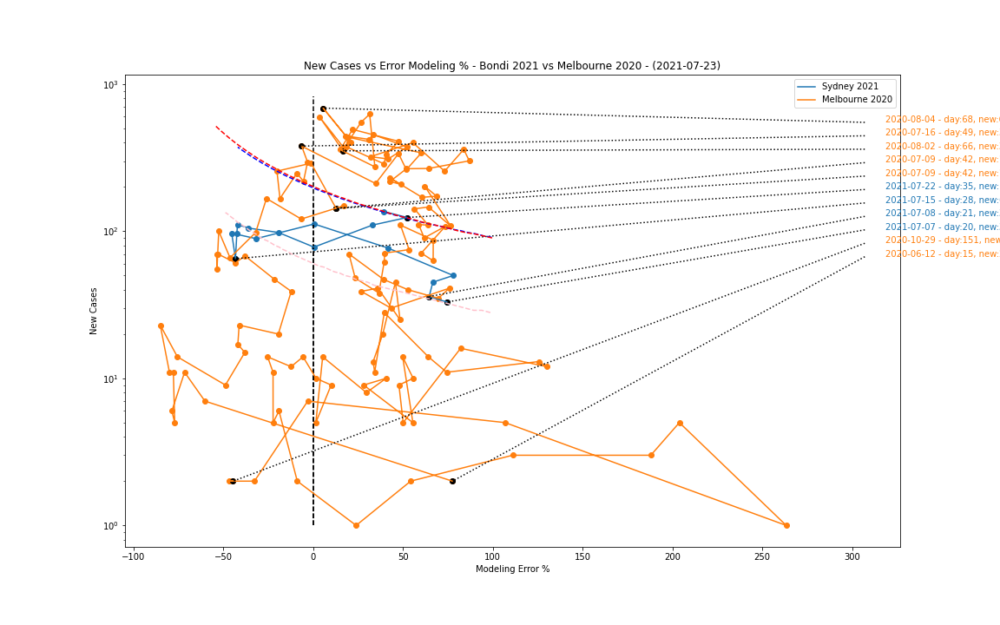

# delta-waratah

A Python library and notebook used to explore the state of the current COVID-19 outbreak that started in Sydney on June 17, 2021.

For more information see the [notebook](sydney-outbreaks.ipynb).

Most data used by this site was compiled by [Juliette O'Brien](https://twitter.com/juliette_io) and her team at [covid19data.com.au](https://covid19data.com.au)
